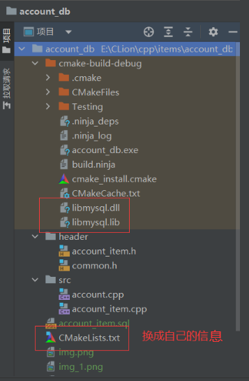

这是一个非常非常基础的，使用C++实现对mysql表中数据进行增删改查操作的代码，附带sql文件。

**需要的配置：**
1. 将CMakeLists.txt中信息改成自己的
2. 将mysql中的两个文件 libmysql.dll 和 libmysql.lib 添加到**cmake-build-debug**中，我的为E:\MySql\MySQL Server 8.0\lib
    
    

[//]: # (3. 添加环境变量（我用的clion）)

[//]: # (    )
[//]: # (    （1）点击编辑配置：)

[//]: # ()
[//]: # (    ![img_3.png]&#40;img_2.png&#41;)

[//]: # ()
[//]: # (    （2）点击编辑配置：)

[//]: # ()
[//]: # (    ![img_4.png]&#40;img_3.png&#41;)

